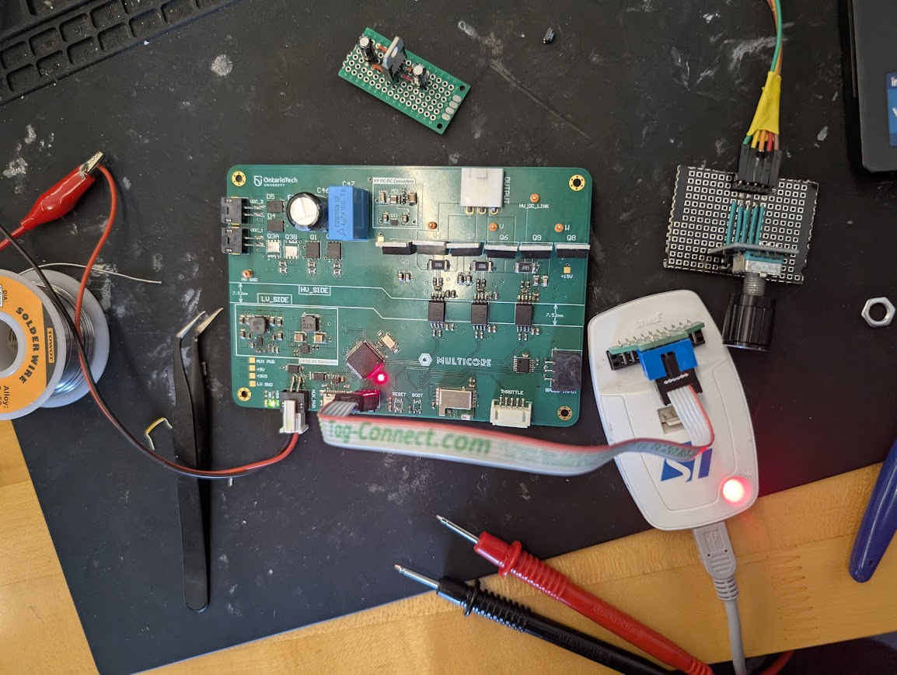
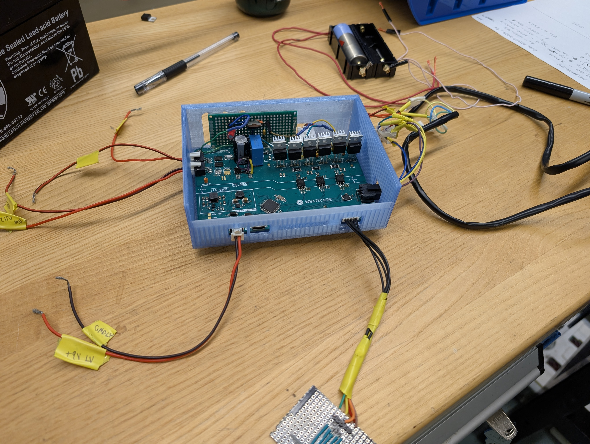

# Multi-Source Inverter (MSI) Motor Controller

This repository contains the firmware for a high-performance **Multi-Source Inverter (MSI)** controller built on the **STM32G491** microcontroller. The project implements advanced field-oriented control (FOC) and dynamic bus voltage switching for high-efficiency motor drive applications.

## 🚀 Key Features

- **25 kHz Fast FOC Loop**: Deterministic field-oriented control triggered by ADC DMA completion.
- **Dynamic Multi-Source Switching**: Seamlessly switches between three voltage rails (12V, 24V, and 36V) based on modulation requirements.
- **Dual-Loop Control**: Cascaded control architecture featuring an outer 100 Hz Speed PI loop and an inner 25 kHz Current PI loop.
- **Telemetry System**: Real-time data transmission via BlueNRG-M0 BLE module.
- **Space Vector Modulation (SVM)**: Optimized duty cycle generation with zero-sequence injection for 15.5% better DC bus utilization.

## 📸 System Overview

| System Architecture |
|:---:|
|  |

*Architecture diagram showing the relationship between sensors, MCU, and power stage.*

| Hardware Setup - Top View | Hardware Setup - Bottom View |
|:---:|:---:|
|  |  |
*Hardware setup of the MultiCore Drive (Assembled PCB and Enclosure views).*

| PSIM Speed Simulation | PDN Analyzer Simulation |
|:---:|:---:|
|  |  |
*Speed Controller Simulation in PSIM and Power Delivery Simulation using Altium Designer*

| Assembled Board | In Enclosure |
|:---:|:---:|
|  |  |
*Final Physical Prototype

## 🛠 Hardware Configuration

- **Controller**: STM32G491RETx (84 MHz SYSCLK)
- **Gate Driver**: UCC21520 (High-side/Low-side isolation)
- **Position Sensor**: AS5047P Magnetic Encoder (SPI)
- **Current Sensing**: AMC1302 Isolated Delta-Sigma Modulators (Integrated Shunt)
- **Communication**: BlueNRG-M0 Bluetooth Module

## 📹 Video Demo

<video src="https://github.com/user-attachments/assets/8038ec60-b21c-4de6-8237-01dfd35394ad"width="80%" controls></video>

## 📂 Project Structure

- `Core/Src/main.c`: Real-time task orchestration and main control loop.
- `Core/Src/foc.c`: Math/logic for Clarke/Park transforms and PI current control.
- `Core/Src/ms_switch.c`: Voltage rail switching logic and safety guardrails.
- `Core/Src/spi.c`: High-speed peripheral communication configuration.

## 🏗 Setup and Compilation

1. Open the project in **STM32CubeIDE**.
2. Right-click the project folder and select **Refresh** to ensure all files are indexed.
3. Click the **Build** button (Hammer icon) or press `Ctrl + B`.
4. Flash the device using an ST-LINK debugger.

---
*Developed as part of the MSI Capstone Project.*
